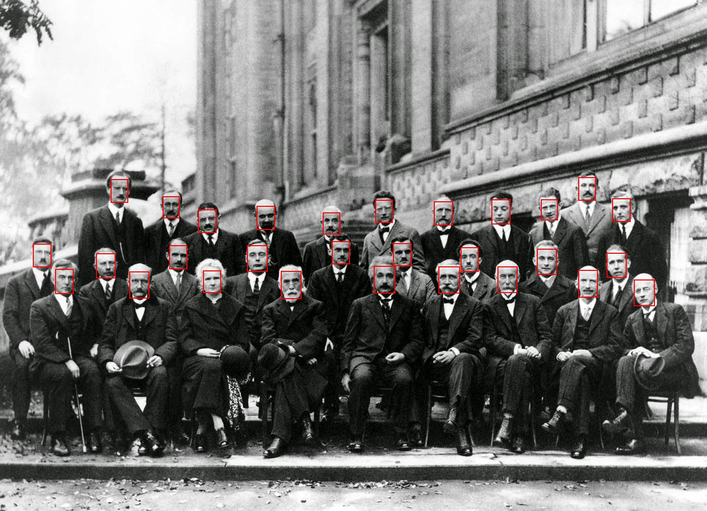
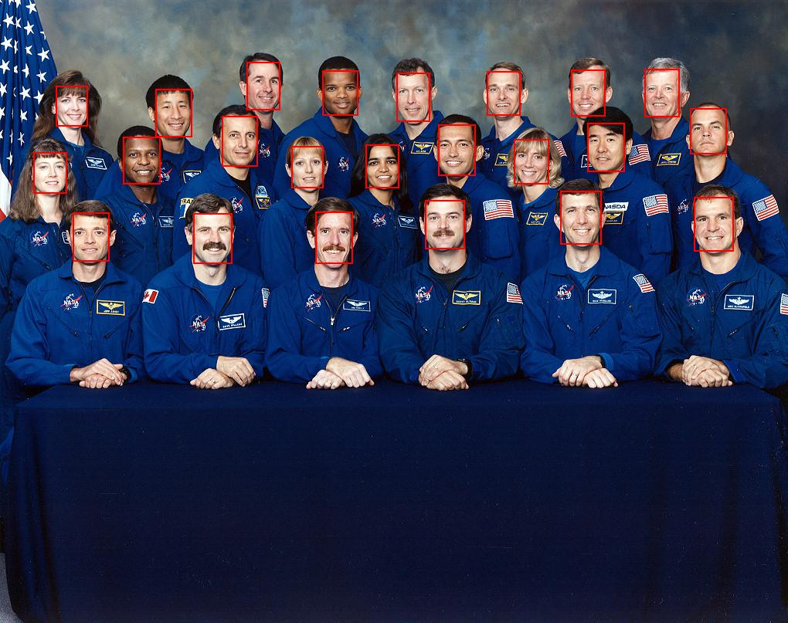

# Face-Detection-MTCNN
Implementation of face detection using Multi Task Cascaded Neural Network using tensorflow

Pretty much same as [this](https://github.com/ipazc/mtcnn), just went through the code and implemented it after understanding what is going on

The original paper can be found [here](https://arxiv.org/ftp/arxiv/papers/1604/1604.02878.pdf)

Some test results:

